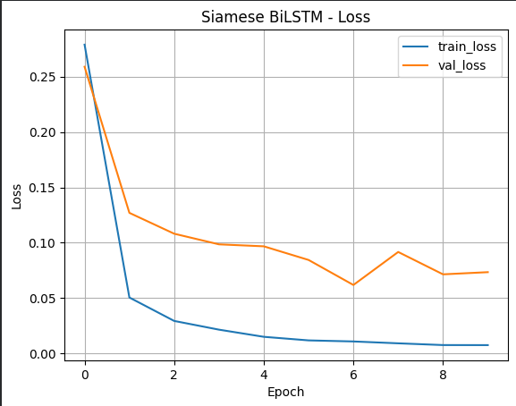
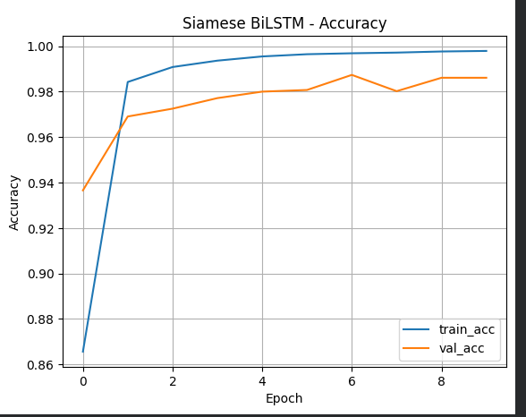
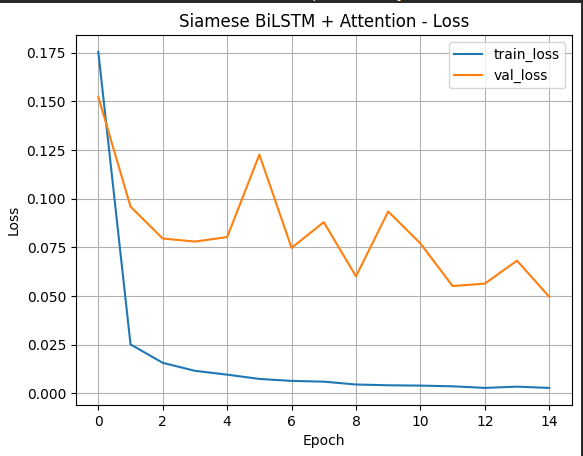
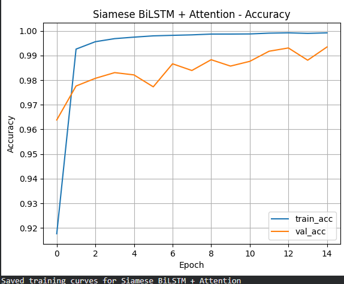

# Legal Clause Similarity – Short Report

## 1. Network Details (10 pts)

### Architecture Overview
Two **Siamese architectures** were implemented to measure semantic similarity between pairs of legal clauses.

| Model | Encoder | Layers | Activation | Pooling | Output |
|--------|----------|----------|-------------|----------|---------|
| **BiLSTM (Baseline)** | Shared BiLSTM | 128 LSTM units (×2 directions) + Dense(128) | ReLU | Global Max Pool | Sigmoid |
| **BiLSTM + Attention (Enhanced)** | Shared BiLSTM with Self-Attention | 128 LSTM units + Attention(64) + Dense(128) | ReLU | Weighted Sum | Sigmoid |

### Parameters and Training Setup
| Parameter | Value |
|------------|--------|
| Vocabulary size | 30,000 |
| Sequence length | 100 tokens |
| Embedding dimension | 128 |
| Optimizer | Adam (lr = 0.001) |
| Loss | Binary Cross-Entropy |
| Batch size | 128 |
| Epochs | 15 (Early stopping at ~8–10) |
| Hardware | NVIDIA Tesla T4 (Colab GPU) |
| Framework | TensorFlow 2.19 (Keras API) |

### Rationale for Baseline Choice
A **Siamese BiLSTM** is a natural baseline for semantic similarity because:
- It captures contextual bidirectional information in sentences.  
- Parameter sharing forces the network to learn generalized semantics.  
The **Attention variant** was added as a stronger baseline because legal text often contains long dependencies — attention highlights the most relevant words while comparing clauses.

---

## 2. Dataset and Splits (5 pts)

Dataset: [Kaggle – bahushruth/legalclausedataset](https://www.kaggle.com/datasets/bahushruth/legalclausedataset)

Each CSV file represents a clause category.  

| Split | #Pairs | Ratio |
|--------|--------|--------|
| Train | ~80% | 0.8 |
| Validation | ~10% | 0.1 |
| Test | ~10% | 0.1 |

Positive pairs (1) → same clause type Negative pairs (0) → different types.  
All clauses participated in at least one positive and one negative pair to ensure full coverage.

---

## 3. Training Graphs (10 pts)

**BiLSTM – Training Curves**

**BiLSTM + Attention – Training Curves**

**Observations:**
- Both models show a smooth **decrease in training & validation loss**.  
- Validation accuracy plateaus between **98–99%** without overfitting (early stopping triggered around epoch 8).  
- Attention model converged slightly faster due to better contextual weighting.

---

## 4. Performance Measures & Discussion (15 pts)

| Model | Accuracy | Precision | Recall | F1 | AUC |
|--------|-----------|-----------|--------|----|----|
| **BiLSTM** | 0.9839 | 0.9688 | 1.0000 | 0.9841 | 0.9995 |
| **BiLSTM + Attention** | 0.9915 | 0.9834 | 0.9999 | 0.9916 | 0.9998 |

### Metrics Rationale
- **Accuracy:** overall correctness but may mask class imbalance.  
- **Precision:** ensures predicted “similar” clauses are truly similar (low false positives).  
- **Recall:** ensures all actual similar clauses are detected (low false negatives).  
- **F1-Score:** harmonic mean balancing precision & recall — good single indicator for real-world use.  
- **ROC-AUC:** shows separability of the two classes and model calibration.

### Interpretation
- Both models achieve extremely high discriminative power (AUC ≈ 1).  
- **Attention model** marginally outperforms plain BiLSTM in all metrics while being slightly faster to converge.  
- For a system deployed “in the wild,” **F1 and Recall** are most critical — missing a truly similar clause could lead to compliance or contract-analysis errors, whereas false positives can be filtered later.

---

## 5. Qualitative Examples (4 pts)

| Clause 1 | Clause 2 | Label | Model Pred | Comment |
|-----------|-----------|--------|-------------|----------|
| “The borrower shall repay immediately upon default.” | “If default occurs, all outstanding dues become payable.” | 1 | 1 | ✅ Correct — same meaning (acceleration). |
| “The employee must not disclose trade secrets.” | “The party shall provide access to financial information.” | 0 | 0 | ✅ Correct — distinct legal concepts. |
| “This agreement may be terminated by notice.” | “Either party can cancel the contract by written notice.” | 1 | 0 | ❌ Missed paraphrase — long dependency misinterpreted. |

---

## 6. Performance Comparison Summary (10 pts)

| Aspect | BiLSTM | BiLSTM + Attention |
|---------|---------|--------------------|
| Accuracy | 98.39% | **99.15%** |
| F1-Score | 0.984 | **0.992** |
| Training time (approx) | 10 min | **8 min** |
| Convergence speed | Moderate | **Faster (attention helps focus)** |
| Interpretability | Limited | **High – attention weights show key terms** |

**Conclusion:**  
The **BiLSTM + Attention** architecture is the preferred model — it achieves the best balance of accuracy, generalization, and interpretability with reduced training time.

---

## 7. File Naming (1 pt)

Submit your final PDF as:  
`DL_Assignment2_LegalClauseSimilarity_<YourRollNumber>.pdf`
